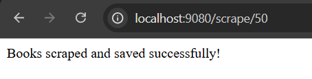

## Щоб запустити проект можна використати два способи ##

## Спосіб №1 ##

- Запустіть проект перейшов у клас TestTaskTraineeJaveApplication
- Щоб зробити перевірку даних у БД: використайте DataGrip або інше середовище для роботи з БД,
                                    створіть новий Data Source(PostgreSQL),
                                    введіть такі credentials: URL: jdbc:postgresql://pg-369f4249-pavlobarabah-bf5c.f.aivencloud.com:16458/defaultdb?sslmode=require
                                                              User: avnadmin
                                                              Password: AVNS_osIpNacsTgfkJ8a0t02
- Відкрити браузер і перйти на http://localhost:9080/scrape/50 (50 - це кількість сторінок(можна змінити на ту кількість яка вам потрібна))
- Завантаження може зайняти деякий час, тому очікуємо на це повідомлення, якщо успішно виконаний запит 

## Спосіб №2 ##

- Перейдіть у файл application.yml і активуйте profile dev(замініть prod на dev)
- Запустіть docker desktop
- Перейдіть у файл docker-compose.yaml і у терміналі запустіть команду docker-compose up -d
- Запустіть проект перейшов у клас TestTaskTraineeJaveApplication
- Щоб зробити перевірку даних у БД: використайте DataGrip або інше середовище для роботи з БД,
                                    створіть новий Data Source(PostgreSQL),
                                    введіть такі credentials: URL: jdbc:postgresql://localhost:5432/bookShop
                                                              User: root
                                                              Password: root
                                                              Port: 5432
- Відкрити браузер і перйти на http://localhost:9080/scrape/50 (50 - це кількість сторінок(можна змінити на ту кількість яка вам потрібна))
- Завантаження може зайняти деякий час, тому очікуємо на це повідомлення, якщо успішно виконаний запит 
